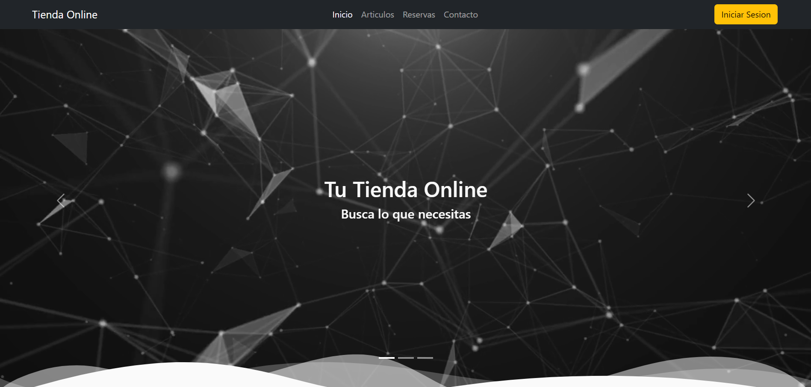
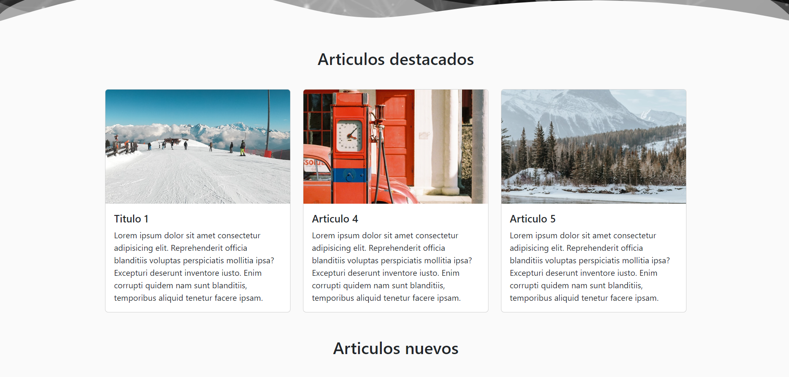
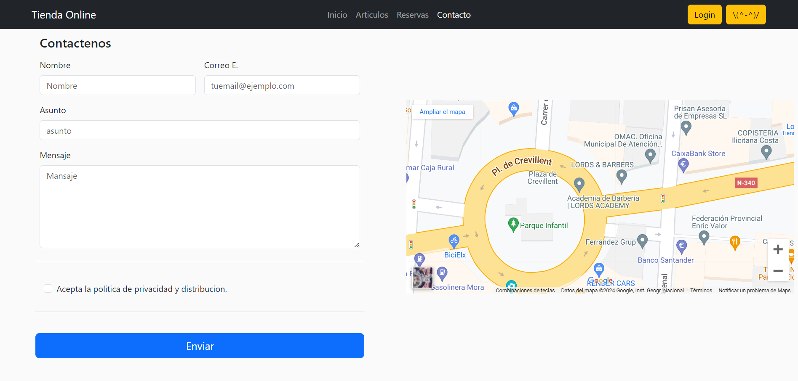

# plantillalogindos

## Inicio Vídeo

## Articulos destacados

## Fotos con fondos svg con animación

## Vista completa

## Iniciar Sesión

## Articulos y listado generado con JavaScript 

## Filtros 

## Form Reservar Mesa con reCAPTCHA v3

## Form Contacto

## Articulo

## Página completa con articulos relacionados

## Para que funcione una sección de este proyecto web, necesitas descargar lo siguiente (utilizado para aprender):

- Isotope PACKAGED v3.0.6, que está licenciado bajo GPLv3 es su versión de licencia de código abierto y también tiene una versión de licencia comercial.

    Para más información sobre las licencias, visita: https://isotope.metafizzy.co/license.html

    Descargar en: https://isotope.metafizzy.co/

    Poner en la carpeta /js/isotope.pkgd.min.js

> - Descargar el vídeo: https://pixabay.com/es/videos/red-lazo-energ%C3%ADa-tecnolog%C3%ADa-12716/
> - Renombrar el archivo a viddiv.mp4 y ponlo en la carpeta plantillalogindos/img/.

## Este archivo contiene LICENCIAS de:

> * Bootstrap  v5.3.0-alpha1 (https://getbootstrap.com/)
> * Copyright 2011-2022 The Bootstrap Authors
> * Licensed under MIT (https://github.com/twbs/bootstrap/blob/main/LICENSE)

> * Font Awesome Free 6.2.1 by @fontawesome - https://fontawesome.com
> * License - https://fontawesome.com/license/free (Icons: CC BY 4.0, Fonts: SIL OFL 1.1, Code: MIT License)
> * Copyright 2022 Fonticons, Inc.
> * iconos/css y webfonts

> * Imágenes de https://unsplash.com/es/licencia
> * (Algunas fueron modificadas)

> * jQuery v3.6.4 | (c) OpenJS Foundation and other contributors | [jquery.org/license](https://jquery.com/license/)